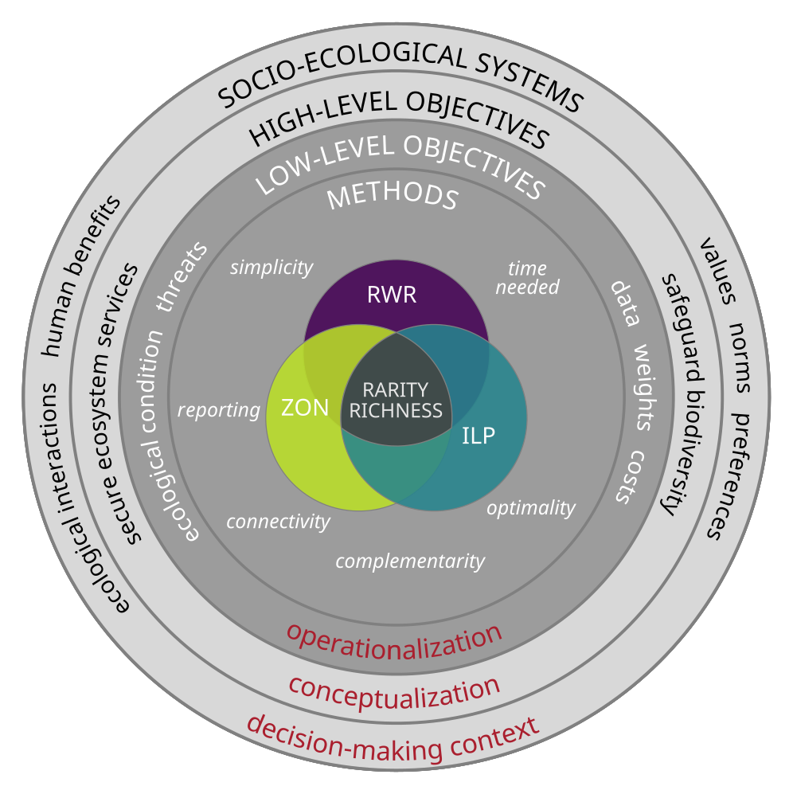
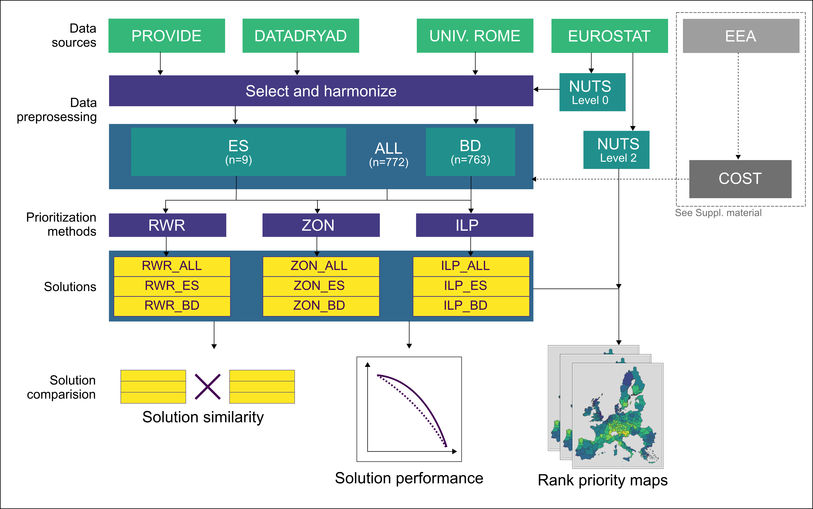

# Results

[TOC]

## Storyline

+ What's the point of each figure? How are figures linked?
  1. **Figure 1**: Study area
     + Main messages
       + Countries/area included in the analysis
     + What's missing
  2. **Figure 2**: Priority rank maps for the three methods x three data groups including the costs.
     + Main messages
       + Spatial distribution and patterns of priorities for different methods / datasets
     + What's missing
  3. **Figure 3**: Aggregate similarity/dissimilarity over NUTS2-regions
     + Main messages
       + Consistently best areas in the north and the south
       + Agreement among different methods generally high in terms of areas
     + What's missing
  4. **Figure 4:** Similarity/dissimilarity triangles for Kendall's Tau, CMCS, and Jaccards for the best and worst 10%. 
     + Main messages
       + BD and ES generally dissimilar
     + What's missing
  5. **Figure 5**: Data group cross-performance (using Zonation only)
     + Main messages
     + What's missing
  6. **Figure 6**: Method x data group performance
     + Main messages

     + What's missing

       ​

+ Storyline for discussion (point-per-paragraph, points ***in bold italics*** still missing)

  + ​

### Potential additional analyses/visualizations

1. From Casalegno et al. (2014):
   1. Moran's I for global spatial autocorrelation
   2. Testing spatial covariance between each of the features using the Clifford Richardson Hemon correlation method (CRH) on rank transformed inputs to correct statistical significance for spatial autocorrelation.

## Tables

### Table 1

Summary table of each taxon: number of total species, endemic species, endangered species and the number of occurrence data that was used in species distribution modeling.

## Tables supplementary material

### Table S1

## Figures

### Figure 1

**Fig. 1** 

### Figure 2

**Fig. 2** 

### Figure 3	

**Fig. 3** 



### Figure 4

**Fig. 4** 

### Figure 5

**Fig. 5 **

### Figure 6

**Fig. 6** 

## Figures supplementary Material

### Figure S1

**Fig S1** 
